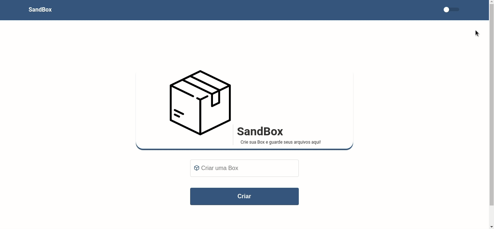

<div  align="center">
  
  <div style="display:flex; flex-direction: column;" >
    <h1 style="margin-left: 10px; margin-top: 20px;" >SandBox</h1>
    <span style="font-size: 14px;">Crie sua Box e guarde seus arquivos aqui!</span>
  </div>
</div>

# SandBox Web 🚀
  Desenvolvido com base na semana omnistack 6, uma  adaptação do codigo feito naquela semana em javascript agora usando typescript não está perfeita pois ainda estou numa fase de aprendizagem.


  Da uma olhada 😎 na interface: [SandBox]()

  

  [link para o Backend 💣 da aplicação feita com NodeJs.](https://github.com/Carlos-Reiss/sandbox-backend)

As tecnologias que utilizei nesse projeto foram:

- React
- Axios
- Date-fns
- Polished
- React-dropzone
- React-icons
- React-router-dom
- React-switch
- Styled-components
- Typescript
- @bdenzer/react-modal

Como baixar e usar o Projeto em sua máquina:

Observação: Por padrão o axios está apontando para o backend para guardar os itens.

```bash
  # clonar repositório
  git clone https://github.com/Carlos-Reiss/sandbox-frontend.git

  # abrir pasta do projeto
  cd sandbox-frontend

  # instalar dependências do projeto
  yarn install ou npm install

  # inicializar projeto
  yarn start

```

